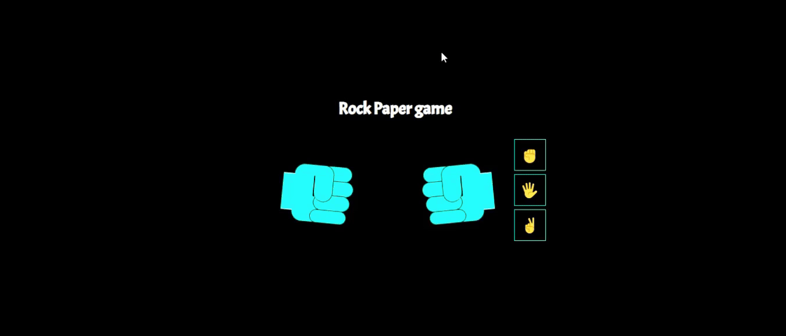

# Rock Paper Game

The **Rock Paper Game** is a simple web-based game where users can play Rock, Paper, Scissors against the computer.

## Getting Started

### Prerequisites

- A web browser (e.g., Google Chrome, Firefox, Safari)

### Running the Game

1. Save the `index.html` file and the associated `style.css` file to your local machine.
2. Open the `index.html` file in your web browser.

## Gameplay

1. The game presents the user with three options: Rock (✊), Paper (🖐️), and Scissors (✌).
2. The user selects their choice by clicking on one of the symbols.
3. The computer's choice is displayed alongside the user's choice.
4. The outcome of the game is displayed, indicating whether the user won, lost, or if it was a tie.
5. To play again, click the "Refresh This Round" button to reset the game.

## Code Overview

### HTML Structure

- The HTML file includes a form with radio inputs for each possible combination of Rock, Paper, and Scissors.
- The `div` elements within the `#hands` and `#symbol` sections display the hands and symbols for the game.
- The `#text` section displays the outcome of the game.

## Notes

- Ensure the `style.css` file is located in the same directory as the `index.html` file for proper styling.
- The game does not have backend logic; it relies on user interaction for game progression.

Enjoy playing the Rock Paper Game!

